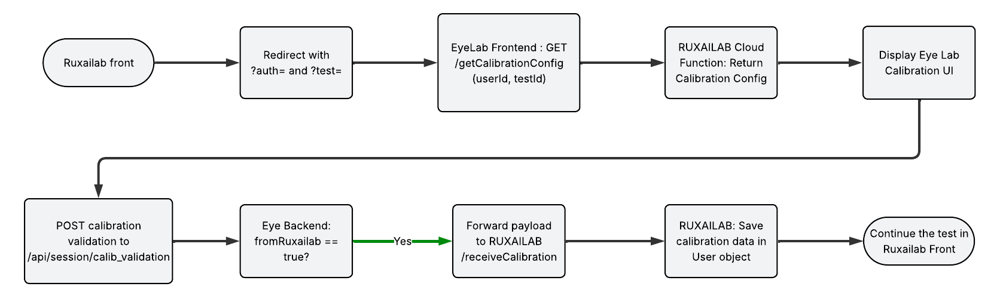

# 👁️ Eye Lab — Web-based Gaze Tracking & Calibration

Eye Lab is an open-source tool for creating **browser-based eye-tracking usability tests** using **Webcam + TensorFlow.js**, without plugins or native installations.

Originally created by [Karine Pistili](https://www.linkedin.com/in/karine-pistili/) as a graduation project, Eye Lab has evolved into a full calibration and gaze-tracking microservice used standalone or fully integrated into **RUXAILAB**.

---

# 🧩 Architecture Overview

Eye Lab has **two repositories**:

| Component | Description |
|----------|-------------|
| **Frontend** (this repo) | Calibration UI + gaze tracking client (Vue.js) |
| **Backend** | API handling calibration uploads and optional forwarding to RUXAILAB |

Backend repository:  
https://github.com/ruxailab/eye-tracker-api

---

# 👩‍💻 Local Setup

### **Prerequisites**
- Vue CLI 4.x  
- Node.js 14.x  

---

### **1. Install dependencies**
```bash
npm install
```

### **2. Run in development mode**
```bash
npm run serve
```

### **3. Build for production**
```bash
npm run build
```

---

# ☁️ Deploying to Firebase Hosting

1. Create a `.env` file with your Firebase credentials:

```
VUE_APP_FIREBASE_API_KEY='your-api-key'
VUE_APP_FIREBASE_AUTH_DOMAIN='your-auth-domain'
VUE_APP_FIREBASE_PROJECT_ID='your-project-id'
VUE_APP_FIREBASE_STORAGE_BUCKET='your-storage-bucket'
VUE_APP_FIREBASE_MESSAGING_SENDER_ID='your-sender-id'
VUE_APP_FIREBASE_APP_ID='your-app-id'
VUE_APP_FIREBASE_MEASUREMENT_ID='your-measurement-id'
```

2. Login and deploy:
```bash
firebase deploy --only hosting
```

---

# 🔄 GitHub CI/CD

This project includes a Firebase Hosting workflow.  
You can customize the settings inside:

```
.github/workflows/
```

---

# 🚀 Eye Lab + RUXAILAB Integration

Eye Lab is used by RUXAILAB as an **external calibration and gaze-tracking service**.  
The workflow below explains the exact communication pipeline.

---

## 🔗 1. Redirect From RUXAILAB → Eye Lab

During a usability test, RUXAILAB redirects the participant to the Eye Lab URL:

```
VUE_APP_EYE_LAB_FRONTEND_URL?auth=<userId>&test=<testId>
```

Eye Lab frontend then:

- sets `fromRuxailab = true`
- sets `calibrationName = userId`
- loads `DoubleCalibrationRecord.vue`
- calls `getRuxailabConfig(auth, test)`  
  → makes a GET request to:

```
${VUE_APP_RUXAILAB_URL}/getCalibrationConfig
```

RUXAILAB returns the admin-defined calibration configuration, which is stored in the Eye Lab Vuex store.

---

## 🎯 2. User Performs Calibration

Eye Lab shows the multi-point calibration interface, collecting:

- iris positions  
- timestamps  
- fixed-point reference geometry  

All data stays **local in the browser** until calibration is completed.

---

## 📡 3. Sending Calibration to Eye Lab Backend

When calibration finishes, Eye Lab calls:

```js
POST /api/session/calib_validation
```

Payload includes (inside FormData):

- `from_ruxailab`
- `file_name` (userId)
- fixed circle iris points
- calibrated iris predictions
- `screen_height`, `screen_width`
- `k` (calibration factor)
- full calibration `model`

---

## 🔁 4. Forwarding Calibration to RUXAILAB

If `from_ruxailab = true`, the Eye Lab backend forwards the following JSON to RUXAILAB:

```json
{
  "session_id": "<file_name>",
  "model": { ...calibrationData },
  "screen_height": 1080, 
  "screen_width": 1920,
  "k": number of points
}
```

Sent to the endpoint:

```
POST /receiveCalibration
```

RUXAILAB then stores this calibration **inside the user object**, making it available for future eye-tracking tests.

---

# 📋 Integration Diagram



---

# 📌 Notes

- **No webcam video is transmitted or stored in this project** — only numeric gaze-related data.
- Accuracy depends on lighting, camera quality and user stability.
- Fully browser-based using TensorFlow.js.

---

# 🧑‍🤝‍🧑 Contributing

Pull requests are welcome.  
Found a bug? Open an issue.

---

# 📄 License

MIT License  
Copyright © Uramaki Lab
